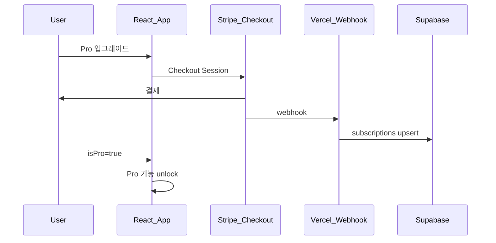

# 유료 결제 — 기술 구현

> Pro 기능 스펙: [features.md](./features.md) · 플랜: [plans.md](./plans.md)

## 아키텍처



## DB (`supabase/migrations/`)

```sql
-- subscriptions
user_id UUID REFERENCES users(id)
stripe_customer_id TEXT
stripe_subscription_id TEXT UNIQUE
plan TEXT  -- 'monthly' | 'yearly' | 'lifetime'
status TEXT
current_period_end TIMESTAMPTZ
```

## 코드 변경

| 영역 | 파일 | 작업 |
|------|------|------|
| Pro 상태 | `AuthContext.tsx` | `isPro`, `subscription` |
| 광고 제거 | `PageShell`, `AdSlot` | [ad-free.md](./ad-free.md) |
| 결제 UI | `src/components/billing/` | Upgrade, Portal |
| API | `api/stripe/` | checkout, portal, webhook |
| Supabase | `supabaseAdapter.ts` | 실구현 |
| 역산 | `reverse.ts`, `ResultPanel` | [reverse-calc.md](./reverse-calc.md) |
| 세트 | prefs / presets | [input-sets.md](./input-sets.md) |

## 환경 변수

```
STRIPE_SECRET_KEY=
STRIPE_WEBHOOK_SECRET=
VITE_STRIPE_PUBLISHABLE_KEY=
STRIPE_PRICE_MONTHLY=
STRIPE_PRICE_YEARLY=
STRIPE_PRICE_LIFETIME=
```

## Phase 1 (2~3주)

1. Supabase + `subscriptions`
2. Stripe Checkout + Webhook + `isPro`
3. [광고 제거](./ad-free.md)
4. Customer Portal + Lifetime SKU

## Phase 2+

[features.md](./features.md) — 역산, 프리셋, 민감도 등

## 법적·운영

- 약관·개인정보: 유료·환불·자동결제 조항
- 환불: 7일 전액 (권장)
- Pro도 참고용 시뮬레이션 고지 유지
