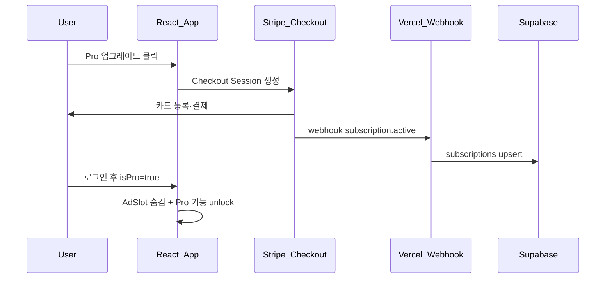

# 기술 구현 로드맵

## 아키텍처



## DB 스키마 추가 (`supabase/migrations/`)

```sql
-- subscriptions
user_id UUID REFERENCES users(id)
stripe_customer_id TEXT
stripe_subscription_id TEXT UNIQUE
plan TEXT  -- 'monthly' | 'yearly'
status TEXT  -- 'active' | 'canceled' | 'past_due'
current_period_end TIMESTAMPTZ

-- saved_presets (Pro)
id UUID, user_id UUID, name TEXT, inputs JSONB, created_at
```

## 코드 변경 포인트

| 영역 | 파일 | 작업 |
|------|------|------|
| Pro 상태 | `src/context/AuthContext.tsx` | `isPro`, `subscription` 필드 |
| 광고 게이트 | `src/components/PageShell.tsx`, `src/components/AdSlot.tsx` | `isPro` 시 렌더 스킵 |
| 결제 UI | `src/components/billing/` (신규) | Upgrade 버튼, 구독 상태, Portal 링크 |
| API | `api/stripe/` (Vercel Functions) | checkout, portal, webhook |
| Supabase | `src/db/adapters/supabaseAdapter.ts` | 스텁 → 실구현 (결제 전 필수) |
| i18n | `src/i18n/locales/ko.ts`, `en.ts` | Pro 관련 문구 |

## 환경 변수 (`.env.example` 추가 예정)

```
STRIPE_SECRET_KEY=
STRIPE_WEBHOOK_SECRET=
VITE_STRIPE_PUBLISHABLE_KEY=
STRIPE_PRICE_MONTHLY=
STRIPE_PRICE_YEARLY=
```

## 구현 단계

### Phase 1 — 기반 (2~3주)

1. Supabase 어댑터 실구현 + `subscriptions` 마이그레이션
2. Stripe Checkout + Webhook + `isPro` 반영
3. 광고 제거 (`PageShell` 조건부 렌더)
4. Stripe Customer Portal (구독 관리)

### Phase 2 — Pro 가치 기능 (2~3주)

5. 저장 프리셋 CRUD
6. 시나리오 비교 뷰 (2~3 컬럼)
7. 민감도 슬라이더 (`evaluate` 모드 확장)
8. 결과 PNG보내기

### Phase 3 — 고급 (선택)

9. 청산 근접 알림 (가격 API + 이메일)
10. 다중 포지션 포트폴리오 뷰
11. 브로커별 템플릿 프리셋 (키움, 미래에셋 등)

## 법적·운영 체크리스트

- 이용약관·개인정보처리방침에 **유료 구독·환불·자동결제** 조항 추가 (`src/i18n/locales/ko.ts` 법적 문구)
- Stripe Dashboard에서 **고객 이메일·영수증** 설정
- 환불 정책: 7일 이내 전액 환불 (출시 초기 신뢰 확보용, 권장)
- 투자 자문 아님 고지 유지 (Pro 기능도 "참고용 시뮬레이션")
